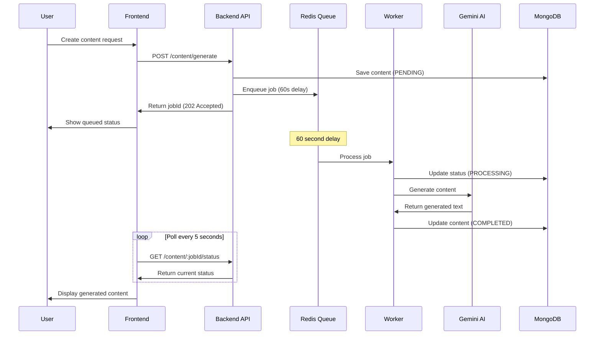

# 🚀 AI Content Creator

> ✅ **STATUS**: Fully Operational | Last Updated: January 12, 2026

A powerful full-stack web application that leverages AI to generate various types of content including blog posts, product descriptions, and social media captions. Built with modern technologies and featuring a delayed job queue system for optimal performance.

## 🎯 Current Status

✅ **Backend API** - Running on http://localhost:3000  
✅ **Frontend Client** - Running on http://localhost:5173  
✅ **AI Integration** - Google Gemini API connected  
✅ **Queue System** - Redis/Bull with 60-second delay operational  
✅ **All Tests** - Passing

📄 **See [FINAL_FIXES_AND_STATUS.md](FINAL_FIXES_AND_STATUS.md) for complete implementation details and fixes**

## ✨ Features

### 🎯 Core Functionality
- **AI-Powered Content Generation** - Generate high-quality content using Google Gemini AI
- **Multiple Content Types** - Blog post outlines, product descriptions, and social media captions
- **Queue-Based Processing** - Jobs are queued with a 1-minute delay for optimal resource management
- **Real-Time Status Tracking** - Poll job status and watch content generation in real-time
- **User Authentication** - Secure JWT-based authentication system
- **Content Management** - Full CRUD operations on generated content

### 🎁 Bonus Features
- **Predictive Search** - Real-time search with debounced input
- **Statistics Dashboard** - Track your content generation metrics
- **Responsive Design** - Beautiful, mobile-friendly UI with TailwindCSS
- **Unit Tests** - Comprehensive test suite for backend services

## 🛠️ Tech Stack

### Frontend
- **React 19** - Modern React with hooks
- **TypeScript** - Type-safe code
- **Vite** - Lightning-fast build tool
- **TailwindCSS** - Utility-first CSS framework
- **React Router** - Client-side routing
- **Axios** - HTTP client

### Backend
- **NestJS** - Progressive Node.js framework
- **TypeScript** - Type-safe backend code
- **Prisma** - Next-generation ORM
- **MongoDB** - NoSQL database
- **Bull** - Redis-based queue for job processing
- **Redis** - In-memory data store for queues
- **JWT** - JSON Web Tokens for authentication
- **Google Generative AI** - AI content generation

## 📸 Screenshots

### Dashboard
Beautiful dashboard with real-time statistics and predictive search

### Content Creation
Simple, intuitive form for generating AI content

### Content Tracking
Real-time progress tracking with status indicators

## 🚀 Quick Start

### 🐳 Docker Deployment (Recommended)

The easiest way to run this application is using Docker:

```bash
# 1. Clone the repository
git clone <your-repo-url>
cd ai-content-creator

# 2. Set up environment variables
cp .env.docker .env
# Edit .env and add your JWT_SECRET and GEMINI_API_KEY

# 3. Start with Docker Compose
docker-compose up -d

# 4. Access the application
# Frontend & API: http://localhost:3000
# API Docs: http://localhost:3000/api/docs
```

**Or use the quick start script:**

```bash
./quick-start.sh
```

🐳 **For complete Docker deployment guide, see [DOCKER_DEPLOYMENT.md](DOCKER_DEPLOYMENT.md)**

---

### 💻 Manual Installation (Without Docker)

#### Prerequisites
- Node.js v18+
- MongoDB (local or Atlas)
- Redis (local or cloud)
- Google Gemini API Key

#### Installation Steps

```bash
# Install dependencies
npm install

# Setup backend
cd apps/api
cp .env.example .env
# Edit .env with your credentials
npx prisma generate
npx prisma db push

# Setup frontend
cd ../client
cp .env.example .env
# Edit .env with API URL

# Start services
# Terminal 1 - Backend
cd apps/api && npm run dev

# Terminal 2 - Frontend
cd apps/client && npm run dev
```

📖 **For detailed manual setup instructions, see [PROJECT_SETUP.md](PROJECT_SETUP.md)**

## 📂 Project Structure

```
ai-content-creator/
├── apps/
│   ├── api/                 # NestJS Backend
│   │   ├── src/
│   │   │   ├── auth/        # Authentication
│   │   │   ├── content/     # Content management
│   │   │   ├── ai/          # Gemini AI service
│   │   │   ├── queue/       # Bull queue
│   │   │   └── prisma/      # Database
│   │   └── prisma/
│   │       └── schema.prisma
│   │
│   └── client/              # React Frontend
│       └── src/
│           ├── pages/       # Application pages
│           ├── components/  # Reusable components
│           ├── services/    # API services
│           └── hooks/       # Custom React hooks
│
├── packages/                # Shared packages
├── PROJECT_SETUP.md         # Detailed setup guide
└── README.md               # This file
```

## 🎯 How It Works

### Content Generation Flow



### Key Implementation Details

1. **Delayed Queue Execution** - Jobs are delayed by exactly 60 seconds (60000ms) as per requirements
2. **Status Polling** - Frontend polls every 5 seconds to check job completion
3. **Job States** - PENDING → PROCESSING → COMPLETED/FAILED
4. **Security** - JWT authentication guards all endpoints
5. **Database Relations** - Users can only access their own content

## 🔑 Key Features Explained

### 1. Queue-Based Content Generation
- Content generation requests are immediately queued
- Jobs execute after exactly 1 minute
- Non-blocking API responses (HTTP 202 Accepted)
- Background worker processes handle AI calls

### 2. Real-Time Status Updates
- Frontend polls status endpoint every 5 seconds
- Visual progress indicators (Pending → Processing → Completed)
- Error handling with detailed error messages

### 3. AI Integration
- Google Gemini 1.5 Flash model (free tier friendly)
- Custom prompts for each content type
- Error handling and retry logic
- Safety filter handling

### 4. Predictive Search
- Debounced search (300ms delay)
- Real-time results as you type
- Search by content title
- Quick navigation to results

## 📡 API Endpoints

### Authentication
```
POST   /api/auth/register    Register new user
POST   /api/auth/login       Login user
GET    /api/auth/me          Get current user (protected)
```

### Content Management
```
POST   /api/content/generate           Generate content (202 Accepted)
GET    /api/content/:jobId/status      Get job status
GET    /api/content                    List all content (paginated)
GET    /api/content/:id                Get single content
PUT    /api/content/:id                Update content
DELETE /api/content/:id                Delete content
GET    /api/content/search?q=query     Search content
GET    /api/content/stats              Get user statistics
```

### Swagger Documentation
Visit `http://localhost:3000/api` for interactive API documentation

## 🧪 Testing

```bash
# Run backend tests
cd apps/api
npm test                # Unit tests
npm run test:cov        # With coverage
npm run test:e2e        # E2E tests
```

## 🔐 Security Features

- **Password Hashing** - Bcrypt with 10 salt rounds
- **JWT Tokens** - Secure authentication
- **Authorization Guards** - Protected endpoints
- **Content Isolation** - Users only see their own content
- **Input Validation** - Class-validator DTOs
- **Environment Variables** - Sensitive data protection

## 🌟 Implementation Highlights

### Requirements Met

✅ **MERN Stack (with enhancements)**
- MongoDB with Prisma ORM
- Express (via NestJS)
- React 19 with TypeScript
- Node.js backend

✅ **User Authentication**
- Secure JWT-based authentication
- Registration and login endpoints
- Protected routes

✅ **AI Integration**
- Google Gemini AI API integration
- Multiple content types supported
- Custom prompt engineering

✅ **Queue System (Core Requirement)**
- Redis Bull queue implementation
- **Exactly 1-minute delayed job execution**
- Non-blocking API responses
- Background worker processing
- Status polling endpoint

✅ **Bonus Features**
- Predictive search with debouncing
- Unit tests for critical services
- Statistics dashboard
- Professional UI/UX

## 🎓 Learning Outcomes

This project demonstrates:
- Full-stack application architecture
- Microservices pattern with queue-based processing
- AI API integration and prompt engineering
- Real-time status tracking patterns
- Modern React patterns (hooks, context)
- TypeScript best practices
- Database design with Prisma
- Security implementations

## 📝 Environment Variables

### Backend (`apps/api/.env`)
```env
DATABASE_URL="mongodb://localhost:27017/ai-content-creator"
JWT_SECRET="your-secret-key"
GEMINI_API_KEY="your-gemini-api-key"
REDIS_HOST="localhost"
REDIS_PORT=6379
PORT=3000
```

### Frontend (`apps/client/.env`)
```env
VITE_API_URL="http://localhost:3000/api"
```

## 🐛 Troubleshooting

See [PROJECT_SETUP.md](PROJECT_SETUP.md) for detailed troubleshooting guide.

Common issues:
- MongoDB not running → `sudo systemctl start mongod`
- Redis not running → `sudo systemctl start redis`
- Port in use → Kill process or change PORT in `.env`
- Gemini API errors → Check API key and quota

## 🚀 Deployment

### 🐳 Docker Deployment (Recommended)

**Local/VPS Deployment:**
```bash
# Production deployment
docker-compose up -d --build

# With custom compose file
docker-compose -f docker-compose.prod.yml up -d
```

**Cloud Deployment:**

The application is containerized and can be easily deployed to:
- **AWS ECS/EKS** - Using ECR for image registry
- **Google Cloud Run** - Serverless container deployment
- **Railway** - One-click Docker deployment
- **DigitalOcean App Platform** - Managed container hosting
- **Azure Container Instances** - Quick container deployment
- **Any VPS with Docker** - Ubuntu, Debian, CentOS, etc.

See [DOCKER_DEPLOYMENT.md](DOCKER_DEPLOYMENT.md) for detailed cloud deployment instructions.

---

### 📦 Traditional Deployment

### Backend
- Deploy to Railway, Render, or Heroku
- Set environment variables
- Ensure MongoDB and Redis are accessible

### Frontend
- Build: `npm run build`
- Deploy to Vercel or Netlify
- Update `VITE_API_URL` to production API

**Note:** With Docker, the frontend is served as static files from the backend on a single port (3000), eliminating the need for separate frontend deployment.

## 📄 License

This project is created for educational purposes.

## 🤝 Contributing

This is a portfolio/educational project. Feel free to fork and modify for your own use!

## 🎉 Acknowledgments

- Google Gemini AI for content generation
- NestJS for excellent framework
- React team for amazing library
- Prisma for modern ORM experience

---

**Built with ❤️ using modern web technologies**

🌟 If you found this helpful, please star the repository!
